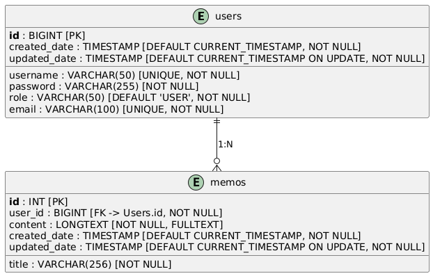
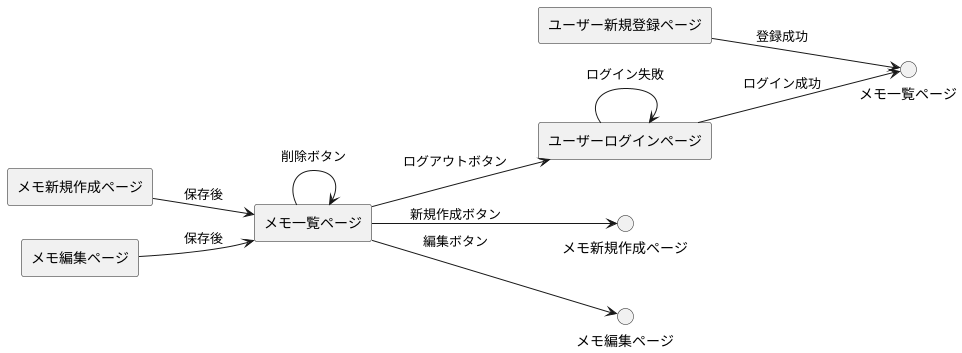

# アプリケーション名

## MeMO（メモ）

## 概要
- このアプリは、日々感じたこと、頭の中に浮かぶアイデアを、シンプルな形で記録できるようにデザインしたものです。
- このアプリが必要な理由は、昨今の情報爆発やSNSによる情報氾濫による疲れを感じる方へ向けたソリューションを提供するためです。
- 主な機能は、シンプルな形でメモを取ることができます。好みに応じて、縦書き・横書きを変更することも可能です。

## URL

## テスト用アカウント
- Basic認証ID：admin
- Basic認証パスワード：1234

# 利用方法
## 新規作成
1. ユーザー認証画面から、新規ログインを行う。
2. トップページのヘッダーから新規メモ作成（🖌ボタン︎）を行う。
3. キーボードでメモを入力し、保存する（📥ボタン）。
4. 投稿したメモを一覧画面で確認できる（🏠ボタンで一覧へ戻る）。
5. 各メモの作成画面ヘッダーから、縦書き・横書きを選択できる。
6. 不要になったメモは、一覧画面で削除できる（🗑︎ボタン）。
7. トップページのヘッダーからログアウトができる。
8. トップページのヘッダーから、テキストベースのブラウザを起動できる（🌐ボタン）

# アプリケーションを作成した背景
転職活動を行う中で、自分自身が心の疲れを感じていました。
日々内省を行う上で、既存のワードアプリやWebサービスでは 機能が多すぎると感じていました。
また、Webサービスを使う際にも、SNSの情報やWebニュース、広告が目に飛び込んでくるたびに
意識をそちらに持って行かれてしまい、「何を考えていたのか」忘れることがありました。
このアプリは、そんな自分と同じ悩みを抱えている方に向けて提供する「解決策」です。

# 洗い出した要件
[要件定義シート](https://docs.google.com/spreadsheets/d/1TEinpuMv9hVxG3aKB4b-xTmGqrDDCc8riq75-HQqAhI/edit?usp=sharing)

# 実装した機能についての画像やGIFおよびその説明

# 実装予定の機能
- ログインパスワードやユーザー名を忘れた場合、登録したメールアドレスに再設定リンクを発行する機能。
- 文字を入力して、本文から検索する機能。

# データベース設計

# 画面遷移図

#### ユーザーログインページ
- **ログイン成功** → メモ一覧ページ
- **ログイン失敗** → ユーザーログインページ（再試行）

#### ユーザー新規登録ページ
- **登録成功** → メモ一覧ページ

#### メモ一覧ページ
- **新規作成ボタン** → メモ新規作成ページ
- **編集ボタン** → メモ編集ページ
- **削除ボタン** → メモ一覧ページ
- **ログアウトボタン** → ユーザーログインページ

#### メモ新規作成ページ
- **保存後** → メモ一覧ページ

#### メモ編集ページ
- **保存後** → メモ一覧ページ

# 開発環境
- フロントエンド
- バックエンド
- インフラ
- テスト
- テキストエディタ：IntelliJ IDEA 2024.3.1.1 (Community Edition)
- タスク管理：GitHub

# ローカルでの動作環境

# 工夫したポイント
